<div align="center">

# 🚀 Terraform AWS CloudFront WAF Site

**A secure and scalable static website architecture using AWS S3, CloudFront, and WAF**

[](https://www.terraform.io/)
[](https://aws.amazon.com/)
[](LICENSE)

*Complete infrastructure-as-code solution for hosting static websites with global content delivery and protection against web exploits*

</div>

---

## 🏗️ Architecture Overview

This project creates a complete static website hosting solution with enterprise-grade security and performance:

```mermaid
graph TB
    A[User] --> B[CloudFront CDN]
    B --> C[WAF Protection]
    C --> D[S3 Bucket]
    E[Route 53] --> B
    F[ACM Certificate] --> B
    
    style B fill:#FF9900
    style C fill:#232F3E
    style D fill:#569A31
```

<div align="center">



</div>

### ✨ Key Features

| Component | Description | Benefits |
|-----------|-------------|----------|
| 🪣 **S3 Bucket** | Secure static website hosting | Encrypted storage, proper access controls |
| 🌐 **CloudFront CDN** | Global content delivery | Low latency, caching, compression |
| 🛡️ **WAF Protection** | Web Application Firewall | Protection against common web exploits |
| 🔐 **Origin Access Control** | Secure S3 access | CloudFront-only access to S3 content |
| 🏷️ **Environment Separation** | Dev/Prod configurations | Isolated environments with different settings |

---

## 📁 Project Structure

```bash
terraform-aws-cloudfront-waf-site/
├── 📁 modules/                    # Reusable Terraform modules
│   ├── 📁 s3/                    # S3 bucket module
│   │   ├── 📄 s3.tf              # All S3 resources
│   │   ├── 📄 variables.tf       # S3 module variables
│   │   └── 📄 outputs.tf         # S3 module outputs
│   ├── 📁 cloudfront/            # CloudFront distribution module
│   │   ├── 📄 cloudfront.tf      # All CloudFront resources
│   │   ├── 📄 variables.tf       # CloudFront module variables
│   │   └── 📄 outputs.tf         # CloudFront module outputs
│   └── 📁 waf/                   # WAF module
│       ├── 📄 waf.tf             # All WAF resources
│       ├── 📄 variables.tf       # WAF module variables
│       └── 📄 outputs.tf         # WAF module outputs
├── 📁 environments/              # Environment-specific configurations
│   ├── 📁 dev/                   # Development environment
│   │   ├── 📄 main.tf            # Dev environment setup
│   │   ├── 📄 variables.tf       # Dev-specific variables
│   │   ├── 📄 outputs.tf         # Dev environment outputs
│   │   └── 📄 terraform.tfvars.example
│   └── 📁 prod/                  # Production environment
│       ├── 📄 main.tf            # Prod environment setup
│       ├── 📄 variables.tf       # Prod-specific variables
│       ├── 📄 outputs.tf         # Prod environment outputs
│       └── 📄 terraform.tfvars.example
├── 📁 scripts/                   # Deployment and utility scripts
│   └── 📄 deploy.sh              # Automated deployment script (executable)
├── 📄 main.tf                    # Root module configuration
├── 📄 variables.tf               # Root module variables
├── 📄 outputs.tf                 # Root module outputs
├── 📄 provider.tf                # Provider configuration
├── 📄 .env.example               # Environment variables template
├── 📄 LICENSE                    # MIT License
└── 📄 README.md                  # This file
```

---

## 🚀 Quick Start

### 📋 Prerequisites

<table>
<tr>
<td>

**Required Tools:**
- [Terraform](https://www.terraform.io/downloads.html) `>= 1.7`
- [AWS CLI](https://aws.amazon.com/cli/) configured
- Git for cloning

</td>
<td>

**AWS Permissions:**
- S3 bucket management
- CloudFront distributions
- WAF web ACLs
- IAM role management

</td>
</tr>
</table>

### 🎯 Option 1: Using the Deployment Script (Recommended)

```bash
# 1. Clone the repository
git clone <repository-url>
cd terraform-aws-cloudfront-waf-site

# 2. Set up AWS credentials
cp .env.example .env
# Edit .env with your AWS credentials
source .env

# 3. Deploy to development (will create config files automatically)
./scripts/deploy.sh dev plan
./scripts/deploy.sh dev apply

# 4. Deploy to production
./scripts/deploy.sh prod plan
./scripts/deploy.sh prod apply
```

### 🛠️ Option 2: Manual Deployment

<details>
<summary><strong>Click to expand manual deployment steps</strong></summary>

#### Development Environment

```bash
cd environments/dev
cp terraform.tfvars.example terraform.tfvars
# Edit terraform.tfvars with your project details

terraform init
terraform plan -var-file="terraform.tfvars"
terraform apply -var-file="terraform.tfvars"
```

#### Production Environment

```bash
cd environments/prod
cp terraform.tfvars.example terraform.tfvars
# Edit terraform.tfvars with your project details

terraform init
terraform plan -var-file="terraform.tfvars"
terraform apply -var-file="terraform.tfvars"
```

</details>

---

## ⚙️ Configuration

### 🔐 Environment Variables

Create a `.env` file from the example:

```bash
# Copy the example file
cp .env.example .env

# Edit with your AWS credentials
export AWS_ACCESS_KEY_ID=your_access_key_here
export AWS_SECRET_ACCESS_KEY=your_secret_key_here
export AWS_DEFAULT_REGION=us-east-1
```

### 📝 Terraform Variables

Each environment has its own `terraform.tfvars` file for customization:

#### 🧪 Development Configuration

```hcl
# Required variables
project_name = "my-awesome-site"
aws_region   = "us-east-1"

# Optional variables
owner_email = "admin@example.com"

# S3 Configuration
s3_versioning_enabled = false    # Cost optimization for dev
s3_block_public_access = true

# CloudFront Configuration
cloudfront_price_class = "PriceClass_100"  # US, Canada, Europe only
```

#### 🏭 Production Configuration

```hcl
# Required variables
project_name = "my-awesome-site"
aws_region   = "us-east-1"

# S3 Configuration
s3_versioning_enabled = true     # Enable versioning for production

# CloudFront Configuration
cloudfront_price_class = "PriceClass_All"  # Global distribution

# SSL Certificate (required for custom domains)
ssl_certificate_arn = "arn:aws:acm:us-east-1:123456789012:certificate/your-cert-id"

# Enhanced WAF rules for production
waf_managed_rules = [
  {
    name                        = "AWS-AWSManagedRulesCommonRuleSet"
    priority                    = 1
    override_action            = "none"
    managed_rule_group_name    = "AWSManagedRulesCommonRuleSet"
    vendor_name                = "AWS"
    excluded_rules             = []
    cloudwatch_metrics_enabled = true
    metric_name                = "waf-rule-common-prod"
    sampled_requests_enabled   = true
  },
  {
    name                        = "AWS-AWSManagedRulesKnownBadInputsRuleSet"
    priority                    = 2
    override_action            = "none"
    managed_rule_group_name    = "AWSManagedRulesKnownBadInputsRuleSet"
    vendor_name                = "AWS"
    excluded_rules             = []
    cloudwatch_metrics_enabled = true
    metric_name                = "waf-rule-bad-inputs-prod"
    sampled_requests_enabled   = true
  }
]
```

---

## 🏛️ Architecture Benefits

### 🎯 **Separation of Concerns**

| Module | Responsibility | Benefits |
|--------|---------------|----------|
| **S3** | Bucket configuration, policies, settings | Easy maintenance, clear ownership |
| **CloudFront** | CDN, caching, origin access | Performance optimization |
| **WAF** | Security rules, IP filtering | Centralized security management |
| **Environments** | Dev/prod configurations | Isolated deployments |

### 🔧 **Resource Organization**

- **Service-specific files**: Each AWS service has its dedicated `.tf` file
- **Logical grouping**: Related resources are grouped for better maintainability  
- **Clear separation**: Infrastructure code vs environment-specific settings

### 🛡️ **Security Best Practices**

<table>
<tr>
<th>Security Layer</th>
<th>Implementation</th>
<th>Protection Against</th>
</tr>
<tr>
<td><strong>S3 Security</strong></td>
<td>• AES-256 encryption<br>• Bucket policies<br>• Public access block</td>
<td>Data breaches, unauthorized access</td>
</tr>
<tr>
<td><strong>CloudFront</strong></td>
<td>• Origin Access Control<br>• HTTPS enforcement<br>• Modern TLS protocols</td>
<td>Man-in-the-middle attacks, protocol downgrade</td>
</tr>
<tr>
<td><strong>WAF</strong></td>
<td>• Managed rule sets<br>• Rate limiting<br>• IP reputation filtering</td>
<td>OWASP Top 10, DDoS, malicious IPs</td>
</tr>
</table>

### 🌍 **Environment Management**

| Environment | Configuration | Use Case |
|-------------|---------------|----------|
| **Development** | • Cost-optimized settings<br>• Basic security<br>• Limited distribution | Testing, development work |
| **Production** | • Enhanced security<br>• Global CDN<br>• Comprehensive monitoring | Live website hosting |

---

## 🔧 Advanced Usage

### 🌐 Custom Domain Setup

<details>
<summary><strong>Step-by-step domain configuration</strong></summary>

1. **Register your domain** and create a Route 53 hosted zone
2. **Request an SSL certificate** in ACM (must be in `us-east-1` for CloudFront)
3. **Update your `terraform.tfvars`**:

```hcl
ssl_certificate_arn = "arn:aws:acm:us-east-1:123456789012:certificate/your-cert-id"
domain_name = "your-domain.com"
```

4. **Add Route 53 alias record** (manual step or additional Terraform module)

</details>

### 🛡️ WAF Customization

<details>
<summary><strong>Advanced WAF configuration examples</strong></summary>

#### Rate Limiting Rules

```hcl
waf_rate_limit_rules = [
  {
    name                        = "RateLimitRule"
    priority                    = 100
    action                     = "block"
    limit                      = 2000
    aggregate_key_type         = "IP"
    cloudwatch_metrics_enabled = true
    metric_name                = "RateLimitRule"
    sampled_requests_enabled   = true
  }
]
```

#### IP Block Lists

```hcl
waf_ip_sets = {
  blocked_ips = {
    name               = "BlockedIPs"
    description        = "IPs to block"
    ip_address_version = "IPV4"
    addresses          = ["192.0.2.0/24", "203.0.113.0/24"]
  }
}
```

</details>

### 📊 Monitoring and Alerts

The infrastructure includes CloudWatch metrics for:

- 📈 **S3 Metrics**: Bucket requests, data transfer
- 🚀 **CloudFront Metrics**: Cache hit ratio, origin latency, error rates
- 🛡️ **WAF Metrics**: Rule matches, blocked requests, sampled requests

---

## 🚢 Deployment

### 🤖 Automated Deployment (Recommended)

The `deploy.sh` script provides a streamlined deployment experience:

```bash
# Available commands
./scripts/deploy.sh <environment> [action]

# Examples
./scripts/deploy.sh dev init      # Initialize Terraform
./scripts/deploy.sh dev plan      # Show deployment plan
./scripts/deploy.sh dev apply     # Apply changes
./scripts/deploy.sh dev output    # Show outputs
./scripts/deploy.sh dev destroy   # Destroy infrastructure

./scripts/deploy.sh prod plan     # Production planning
./scripts/deploy.sh prod apply    # Production deployment
```

**Features:**
- ✅ Automatic configuration file creation
- ✅ Environment validation
- ✅ AWS credential checks
- ✅ Production deployment confirmations
- ✅ Color-coded output for better readability

### 🏗️ State Management

For production environments, configure remote state storage:

```hcl
terraform {
  backend "s3" {
    bucket         = "your-terraform-state-bucket"
    key            = "static-site/prod/terraform.tfstate"
    region         = "us-east-1"
    encrypt        = true
    dynamodb_table = "terraform-state-locks"
  }
}
```

---

## 📊 Outputs

After successful deployment, you'll receive:

| Output | Description | Example |
|--------|-------------|---------|
| **S3 Bucket Name** | For uploading static files | `my-site-prod-a1b2c3d4` |
| **CloudFront URL** | Global CDN endpoint | `d123456789.cloudfront.net` |
| **WAF Web ACL ARN** | Security configuration reference | `arn:aws:wafv2:us-east-1:...` |
| **Website URL** | Complete HTTPS URL | `https://d123456789.cloudfront.net` |

---

## 💰 Cost Optimization

### 💡 Development Environment
- **PriceClass_100**: US, Canada, Europe only
- **Basic WAF rules**: Essential protection only
- **No versioning**: Reduced storage costs
- **Estimated cost**: ~$5-15/month (depending on traffic)

### 🏭 Production Environment
- **Configurable price class**: Based on global reach needs
- **Comprehensive WAF**: Full protection suite
- **Versioning enabled**: Content rollback capability
- **Estimated cost**: ~$15-50/month (depending on traffic and distribution)

---

## 🐛 Troubleshooting

### ❓ Common Issues

<details>
<summary><strong>Certificate Error</strong></summary>

**Problem**: SSL certificate not working with CloudFront

**Solution**: Ensure SSL certificates are requested in the `us-east-1` region for CloudFront compatibility.

```bash
aws acm list-certificates --region us-east-1
```

</details>

<details>
<summary><strong>S3 Access Denied</strong></summary>

**Problem**: Cannot access S3 bucket through CloudFront

**Solution**: Check bucket policies and Origin Access Control configuration. The S3 bucket should only allow access from CloudFront.

</details>

<details>
<summary><strong>WAF Blocking Legitimate Traffic</strong></summary>

**Problem**: WAF is blocking legitimate requests

**Solution**: Review WAF logs in CloudWatch and adjust rules or add exclusions:

```bash
aws logs filter-log-events --log-group-name aws-waf-logs-cloudfront
```

</details>

<details>
<summary><strong>CloudFront Not Updating</strong></summary>

**Problem**: Changes not reflecting on CloudFront

**Solution**: CloudFront changes can take 15-20 minutes to propagate globally. You can also create an invalidation:

```bash
aws cloudfront create-invalidation --distribution-id EDFDVBD632BHDS5 --paths "/*"
```

</details>

### 🔧 Useful Commands

```bash
# Terraform operations
terraform plan -detailed-exitcode
terraform apply -auto-approve
terraform destroy -auto-approve
terraform output

# Import existing resources
terraform import aws_s3_bucket.static_site bucket-name

# State management
terraform state list
terraform state show aws_cloudfront_distribution.this

# AWS CLI helpers
aws s3 ls
aws cloudfront list-distributions
aws wafv2 list-web-acls --scope=CLOUDFRONT --region=us-east-1
```

---

## 🤝 Contributing

We welcome contributions! Here's how you can help:

1. **🍴 Fork** the repository
2. **🌿 Create** a feature branch (`git checkout -b feature/amazing-feature`)
3. **✅ Make** your changes and test with both dev and prod environments  
4. **📝 Commit** your changes (`git commit -m 'Add amazing feature'`)
5. **🚀 Push** to the branch (`git push origin feature/amazing-feature`)
6. **📮 Open** a Pull Request

### 📋 Development Guidelines

- Test changes in development environment first
- Update documentation for any new features
- Follow Terraform best practices
- Add appropriate tags and comments

---

## 📄 License

This project is licensed under the **MIT License** - see the [LICENSE](LICENSE) file for details.

---

## 🆘 Support & Resources

<div align="center">

### 🔗 Helpful Links

[](https://www.terraform.io/docs)
[](https://docs.aws.amazon.com/)
[](https://docs.aws.amazon.com/cloudfront/)

</div>

### 📞 Getting Help

1. **📖 Check** the troubleshooting section above
2. **🔍 Review** AWS documentation for specific services  
3. **🐛 Open** an issue in this repository
4. **💬 Join** the [Terraform Community](https://discuss.hashicorp.com/c/terraform-core/)

---

<div align="center">

**⭐ If this project helped you, please give it a star! ⭐**

*Built with ❤️ using Terraform and AWS*

</div>

## 🚀 Quick Start

### Prerequisites

- [Terraform](https://www.terraform.io/downloads.html) >= 1.7
- [AWS CLI](https://aws.amazon.com/cli/) configured with appropriate credentials
- An AWS account with necessary permissions

### 1. Clone and Setup

```bash
git clone <repository-url>
cd terraform-aws-cloudfront-waf-site

# Set up AWS credentials
cp .env.example .env
# Edit .env with your AWS credentials
source .env
```

### 2. Deploy to Development

```bash
cd environments/dev
cp terraform.tfvars.example terraform.tfvars
# Edit terraform.tfvars with your project details

terraform init
terraform plan
terraform apply
```

### 3. Deploy to Production

```bash
cd environments/prod
cp terraform.tfvars.example terraform.tfvars
# Edit terraform.tfvars with your project details

terraform init
terraform plan
terraform apply
```

## ⚙️ Configuration

### Environment Variables

Create a `.env` file from the example:

```bash
export AWS_ACCESS_KEY_ID=your_access_key
export AWS_SECRET_ACCESS_KEY=your_secret_key
export AWS_DEFAULT_REGION=us-east-1
```

### Terraform Variables

Each environment has its own `terraform.tfvars` file:

```hcl
# Required variables
project_name = "my-static-site"
aws_region   = "us-east-1"

# Optional variables
owner_email  = "admin@example.com"

# S3 Configuration
s3_versioning_enabled = true
s3_block_public_access = true

# CloudFront Configuration
cloudfront_price_class = "PriceClass_100"
ssl_certificate_arn = "arn:aws:acm:us-east-1:123456789012:certificate/12345678-1234-1234-1234-123456789012"

# WAF Configuration (customize as needed)
```

## 🏛️ Architecture Benefits

### 1. Separation of Concerns
- **S3 Module**: Handles all bucket configuration, policies, and settings
- **CloudFront Module**: Manages distributions, caching, and origin access
- **WAF Module**: Configures security rules and IP filtering
- **Environment Separation**: Isolated dev/prod configurations

### 2. Resource Organization
- Each AWS service has its dedicated file (`s3.tf`, `cloudfront.tf`, `waf.tf`)
- Related resources are grouped for better maintainability
- Clear separation between infrastructure and environment settings

### 3. Security Best Practices
- **S3 Security**: Encrypted storage, proper bucket policies, blocked public access
- **CloudFront**: Origin Access Control (OAC) for secure S3 access
- **WAF**: Multiple managed rule sets, rate limiting, IP reputation filtering
- **HTTPS**: Forced HTTPS redirects and modern TLS protocols

### 4. Environment Management
- **Development**: Cost-optimized, basic security, limited distribution
- **Production**: Enhanced security, global CDN, comprehensive monitoring
- **Flexibility**: Easy environment-specific customization

## 🔧 Advanced Usage

### Custom Domain Setup

1. Register your domain and create a Route 53 hosted zone
2. Request an SSL certificate in ACM (us-east-1 for CloudFront)
3. Update your `terraform.tfvars`:

```hcl
ssl_certificate_arn = "arn:aws:acm:us-east-1:123456789012:certificate/your-cert-id"
domain_name = "your-domain.com"
```

### WAF Customization

Add custom WAF rules in your environment configuration:

```hcl
waf_rate_limit_rules = [
  {
    name                        = "RateLimitRule"
    priority                    = 100
    action                     = "block"
    limit                      = 2000
    aggregate_key_type         = "IP"
    cloudwatch_metrics_enabled = true
    metric_name                = "RateLimitRule"
    sampled_requests_enabled   = true
  }
]

waf_ip_sets = {
  blocked_ips = {
    name               = "BlockedIPs"
    description        = "IPs to block"
    ip_address_version = "IPV4"
    addresses          = ["192.0.2.0/24"]
  }
}
```

### Monitoring and Alerts

The infrastructure includes CloudWatch metrics for:
- S3 bucket access
- CloudFront distribution performance
- WAF rule matches and blocks

## 🚢 Deployment

### Automated Deployment

Use the provided deployment script:

```bash
./scripts/deploy.sh dev    # Deploy to development
./scripts/deploy.sh prod   # Deploy to production
```

### Manual Deployment

For development:
```bash
cd environments/dev
terraform init
terraform plan -var-file="terraform.tfvars"
terraform apply -var-file="terraform.tfvars"
```

For production:
```bash
cd environments/prod
terraform init
terraform plan -var-file="terraform.tfvars"
terraform apply -var-file="terraform.tfvars"
```

### State Management

For production environments, configure remote state storage:

```hcl
terraform {
  backend "s3" {
    bucket = "your-terraform-state-bucket"
    key    = "static-site/prod/terraform.tfstate"
    region = "us-east-1"
  }
}
```

## 📊 Outputs

After deployment, you'll receive:

- **S3 Bucket Name**: For uploading your static files
- **CloudFront URL**: Your website's global CDN endpoint
- **WAF Web ACL ARN**: For additional security configuration
- **Website URL**: Complete HTTPS URL for your site

## 🔒 Security Features

- **S3 Bucket Encryption**: AES-256 server-side encryption
- **Bucket Policies**: Restrict access to CloudFront only
- **Public Access Block**: Prevents accidental public exposure
- **WAF Protection**: AWS Managed Rules for common threats
- **HTTPS Enforcement**: Redirects all HTTP traffic to HTTPS
- **Origin Access Control**: Secures S3 access through CloudFront

## 💰 Cost Optimization

### Development Environment
- PriceClass_100 (US, Canada, Europe)
- Basic WAF rules
- No versioning to reduce storage costs

### Production Environment
- Configurable price class based on global reach needs
- Comprehensive WAF protection
- Versioning enabled for content rollback

## 🐛 Troubleshooting

### Common Issues

1. **Certificate Error**: Ensure SSL certificates are in `us-east-1` region
2. **S3 Access Denied**: Check bucket policies and OAC configuration
3. **WAF Blocking**: Review WAF logs in CloudWatch
4. **Distribution Not Updating**: CloudFront changes can take 15-20 minutes

### Useful Commands

```bash
# Check Terraform plan
terraform plan -detailed-exitcode

# Destroy infrastructure
terraform destroy

# Import existing resources
terraform import aws_s3_bucket.static_site bucket-name

# View state
terraform state list
terraform state show aws_cloudfront_distribution.this
```

## 🤝 Contributing

1. Fork the repository
2. Create a feature branch
3. Make your changes
4. Test with both dev and prod environments
5. Submit a pull request

## 📄 License

This project is licensed under the MIT License - see the LICENSE file for details.

## 🆘 Support

For issues and questions:
1. Check the troubleshooting section
2. Review AWS documentation for specific services
3. Open an issue in the repository

---

**Note**: Always review and understand the Terraform plan before applying changes to production environments.
